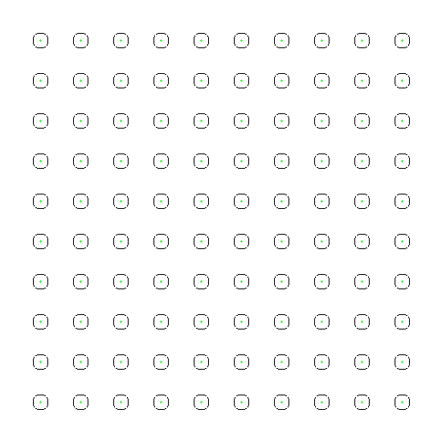

# go-orca
Golang implementation of the Optimal Reciprocal Collision Avoidance (ORCA)
algorithm

## Disclaimer

This project is under active development and is not yet feature complete, and
may contain bugs. We welcome contributions in the form of new issues and pull
requests.

This project was created after endlessly consulting the canonical implementation
[github.com/snape/RVO2](https://github.com/snape/RVO2) and follows the general
shape of the reference. General improvements lie in abstracting away some code
and documenting a number of assumptions the reference implementation makes.

## Background

ORCA is useful for local collision avoidance in large systems.  This repository
aims to be an implementation of the ORCA algorithm with much improved
documentation and API.

More prosaic documentation of this library will be made available at
[blog.downflux.com](https://blog.downflux.com) soon.

## Installation

```bash
go version
> go version go1.17.4 linux/amd64
```

## Updating

```bash
go get -u ./...
go mod tidy
```

## Demo

```bash
go run \
  demo/generator/main.go --mode=grid | go run \
  demo/main.go --frames=1250 > demo.gif
```



## Profiling

**N.B.**: WSL does not profile correctly. See
[golang/go#22366](https://github.com/golang/go/issues/22366).

```bash
go test -v \
  github.com/downflux/go-orca/... \
  -bench . \
  -benchmem -cpu 1,2,4,8,16,32,64

go test -v \
  github.com/downflux/go-orca/orca \
  -bench BenchmarkStep/N=1000000 \
  -benchmem \
  -cpuprofile cpu.out
  -memprofile mem.out

go tool pprof -tree -nodecount=10 cpu.out
```

See [pprof](https://github.com/google/pprof/blob/master/README.md) for more
information.

### Sample Metrics

```bash
$ go test github.com/downflux/go-orca/orca -bench .
goos: linux
goarch: amd64
pkg: github.com/downflux/go-orca/orca
cpu: Intel(R) Core(TM) i7-6700K CPU @ 4.00GHz
BenchmarkStep/Size=1/N=1000-8                224           5291836 ns/op
BenchmarkStep/Size=2/N=1000-8                388           3168457 ns/op
BenchmarkStep/Size=4/N=1000-8                508           2633228 ns/op
BenchmarkStep/Size=8/N=1000-8                576           2321055 ns/op
BenchmarkStep/Size=16/N=1000-8               693           2004639 ns/op
BenchmarkStep/Size=32/N=1000-8               730           1948345 ns/op
BenchmarkStep/Size=64/N=1000-8               705           1974854 ns/op
BenchmarkStep/Size=1/N=10000-8                 7         171990286 ns/op
BenchmarkStep/Size=2/N=10000-8                 9         112703811 ns/op
BenchmarkStep/Size=4/N=10000-8                19          75218658 ns/op
BenchmarkStep/Size=8/N=10000-8                19          66837863 ns/op
BenchmarkStep/Size=16/N=10000-8               24          67420958 ns/op
BenchmarkStep/Size=32/N=10000-8               32          59837678 ns/op
BenchmarkStep/Size=64/N=10000-8               24          58414696 ns/op
BenchmarkStep/Size=1/N=100000-8                1        32582184800 ns/op
BenchmarkStep/Size=2/N=100000-8                1        19468817500 ns/op
BenchmarkStep/Size=4/N=100000-8                1        12772734100 ns/op
BenchmarkStep/Size=8/N=100000-8                1        10489621800 ns/op
BenchmarkStep/Size=16/N=100000-8               1        10855534900 ns/op
BenchmarkStep/Size=32/N=100000-8               1        10736456000 ns/op
BenchmarkStep/Size=64/N=100000-8               1        10513208500 ns/op
PASS
ok      github.com/downflux/go-orca/orca        139.516s
```
### Performance

Performance metrics shoud be compared against [Granberg][1], [Snape et al.][2],
and [van den Berg et al.][3]. We estimate that there is about another 50%
optimization achievable in the current implementation of the ORCA algorithm.


## TODO

We have not yet implemented generating velocity objects for polygonal obstacles.
The current implementation only adjusts trajectory for other circular agents.

[1]: https://arongranberg.com/astar/docs_beta/local-avoidance.html
[2]: https://www.intel.com/content/www/us/en/developer/articles/technical/reciprocal-collision-avoidance-and-navigation-for-video-games.html
[3]: http://emotion.inrialpes.fr/fraichard/safety2010/10-vandenberg-etal-icraw.pdf
[4]: https://github.com/snape/RVO2
